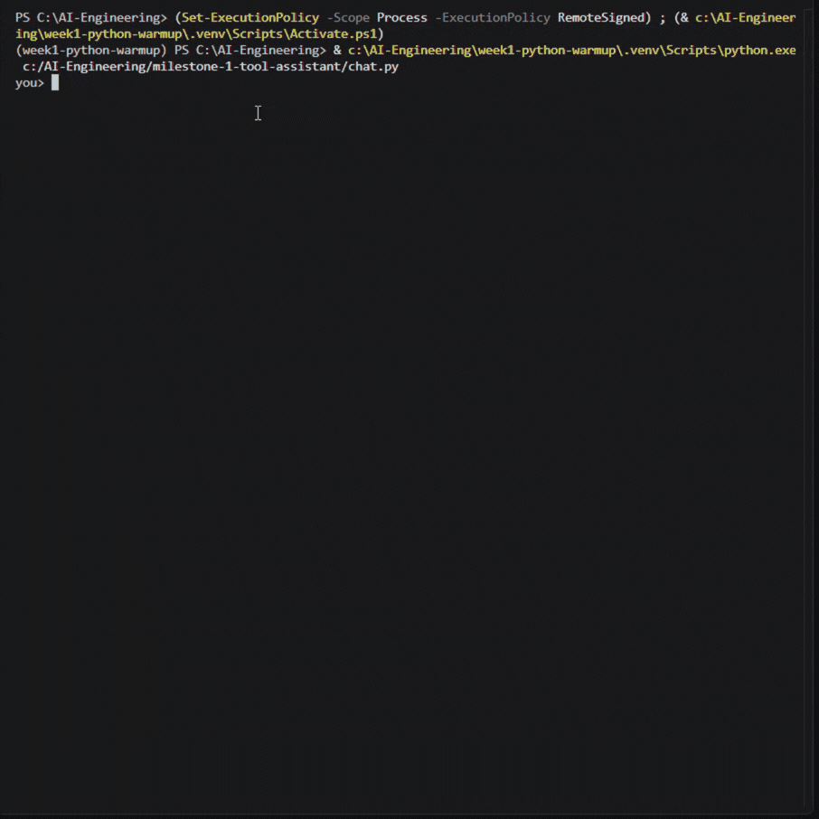

# HealthCalc (AI Health Metrics Report Assistant)
An agentic health-report generator built on Claude's tool-caling API. Give it patient data in plain English and it calculates BMI, kidney function (eGFR), and 10-year cardiovascular risk using validated clinical formulas.

## What it does?
You describe a patient in plain language or point it at a data file. The asssistant figures out which calculations apply, asks for anything it's missing instead of guessing, calls the right tools to get exact numbers, and returns either a readable report or strict structured JSON format, your choice.  
  
you> 45 year old male, 78kg, 172cm, creatinine 1.0, total cholesterol 210,
     hdl 45, systolic bp 135, not on bp medication, non-smoker, no diabetes.
     give me the full report.

bot> Here's what I extracted — let me know if anything looks off:
     - Age: 45, Sex: male
     - Weight: 78 kg, Height: 172 cm
     - Creatinine: 1.0 mg/dL
     - Total cholesterol: 210 mg/dL, HDL: 45 mg/dL
     - Systolic BP: 135 mmHg, on BP medication: no
     - Smoker: no, Diabetes: no

     Calculating BMI, kidney function, and cardiovascular risk now.

     ## Health Report
     **Body Mass Index (BMI)**
     - Value: 26.4 — Overweight (Asian BMI standard)
     **Kidney Function (eGFR)**
     - Value: 94.6 mL/min/1.73m² — G1 (Normal or high)
     **Cardiovascular Risk (10-year)**
     - Value: 7.7% — Low risk

     ---
     *This report is for informational purposes only and is not a
     substitute for professional medical advice...*

## Why I built it this way?
Medical calculations need to be exact. Every number in this project comes from a deterministic Python function implementing a published clinical formula, so the LLM'S job is routing, extraction, and explanation, but never arithmetic. LLMs are good at language, but not reliable at computation, and a health tool is the wrong place to find that out the hard way.

## Key design decisions
1. 2 eGFR equations, routed by age.  
CKD-EPI 2021 (adult, race-free) is only validated for ages 25+. For ages 1-25, I implemented the CKiD U25 creatinine equation instead. This is because using an adult formula on a pediatric patient silently produces a biased data, which leads to more inaccurate analysis.  
2. Cardiovascular risk is age-gated, not just age-labeled.  
The Framingham 2008 model is not validated under 30. Rather than let the LLM call the tool anyway and get a meaningless percentage, the system prompt excludes CVD risk entirely for under 30 patients and skips asking for CVD-specific fields (cholesterol, blood pressure, etc) they would never need.  
3. The model never guesses missing or ambiguous data.  
If height and weight look swapped, or a lab value is missing, it asks and will not silently assume. This is enforced in the system prompt with explicit few-shot examples of the "ask, don't guess" behaviour.  
4. JSON mode does not stream, prose mode does.  
Streaming raw JSON character-by-character to a terminal is unreadable, and the tool needs the complete response before it can validate it against the schema anyway. Prose mode streams for a natural chat feel.  
5. User can pick which analysis to run.  
Asking for "just my BMI" should not trigger the cvd and egfr tool call and irrelevant follow-up questions.  

## How it works?
1. User message (plain text or uploaded file) goes to Claude along with a system prompt and the list of available tools.  
2. The model decides which tools it needs, restates the values it extracted so the user can correct them, then calls tools like calculate_bmi or calculate_egfr_pediatric.  
3. Each tool call is looked up in a REGISTRY dict and executed as a plain Python function — validated with pydantic, wrapped in try/except, returning either a result string or a clean ERROR: ... message (never a raw traceback).  
4. Tool results go back to the model, which may call more tools or return a final answer.
5. In JSON mode, the final answer is parsed, validated against a strict pydantic schema, and — if invalid — sent back to the model with the validation error attached, asking for a corrected version (up to 2 retries) before falling back gracefully.  
6. The user can save the report as a downloadable, timestamped .json file with /save report, or the full conversation transcript with /save.

## Setup
git clone https://github.com/rachellvns/milestone-1-tool-assistant.git  
cd milestone-1-tool-assistant  
.venv/Scripts/Activate  
pip install anthropic pydantic python-dotenv  
create a .env file in the project root  
run the chat.py: python chat.py  

## Commands
/mode default	= Human-readable, streamed report output (default)
/mode json	= Strict structured JSON output
/save	= Save the full conversation transcript
/save report	= Save just the last generated report as a downloadable JSON file
/tokens	= Show cumulative token usage and estimated API cost
/quit or exit	= End the session

## Demo GIF
